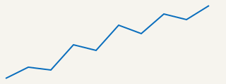

Build this page with `mkdoc build example/measures.md`, or open it in a live
server with `mkdoc dev example/measures.md`.

## Math

The macros `\bfX`, `\calF` and `\bbR` below are baked into mkdoc; `\PP` and
`\EE` come from this document's own `katex_macros`. Everything is rendered by
KaTeX at build time, so the page needs no JavaScript to display it.

Let $(\Omega, \calF, \PP)$ be a probability space and let $\bfX$ be a random
vector in $\bbR^d$. Its expectation is

$$
\EE[\bfX] = \int_\Omega \bfX(\omega) \, \PP(d\omega),
$$

whenever $\EE\|\bfX\| < \infty$.

## Files next to the document

An image is referenced the ordinary way, and mkdoc hands it to Vite to hash and
emit alongside the page:



A fenced block whose whole body is `{./path}` is replaced by that file, so a
quoted snippet cannot drift from the code it quotes. A line range is optional:

```
{./sample.rs:0..2}
```

## Styling

The page's own look comes from mkdoc. A document adds to it by naming a
stylesheet in its frontmatter:

```yaml
css: ./wide.css
```
